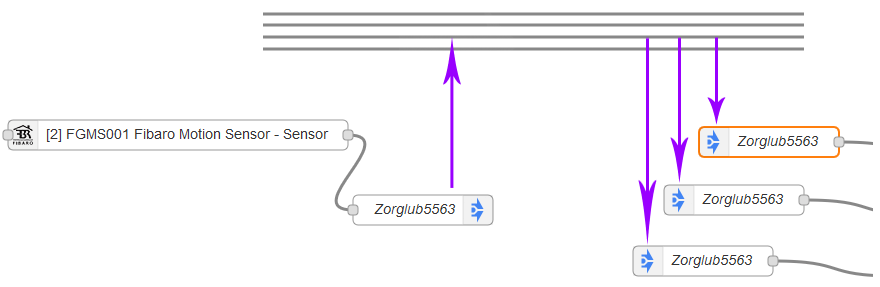
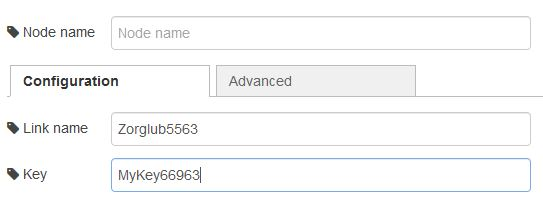
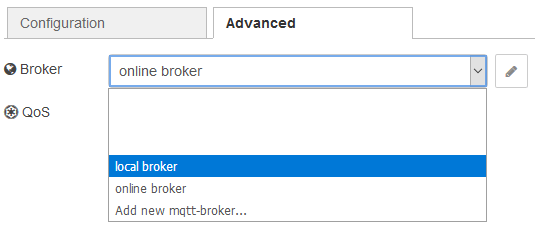

# ttb-node-jump

ttb-node-jump is a Node-RED node to send/receive a msg locally into a device or between two or more devices.

Suppose a temperature sensor in a holiday house, and you want to get its data in your main home: the jump node can be used for that.

More precisely, imagine a virtual cable (we call it a "broker") with several named wires (we call them "links") somewhere in the cloud. You can push data to a particular wire of that cable using the jump out node.
Anywhere in the word, you can also use a jump in node to get the data, using the same named wire.

In this picture, the left and right parts are completely separated and can be on the same device or on two separated devices anywhere in the world.

Here is the way the nodes should be edited: provide the name of the link to use (you can use any name without space but avoid toot simple ones since anyone using the same will also get your datas) and a key to encrypt the data (since there is a way to get a list of all used links):

Internally, the jump nodes use the MQTT protocol and a public broker provided by https://www.hivemq.com/ (thanks to them!) to send the whole msg object as an encrypted bloc. Any MQTT topic can be used as a link name.

To achieve more privacy, you can use your own non public broker in the advanced tab. Again, HiveMQ is a good start (https://www.hivemq.com/downloads/). Alternatively, consider https://mosquitto.org/.

Change the broker into the advanced tab.
If you want to restrict the use on the same device, you can choose "local" broker. In this case, datas does not go out the device.

To learn more about the advanded Jump nodes capabilities, refer to the excellent tutorial https://www.hivemq.com/blog/mqtt-essentials-part-1-introducing-mqtt/

## Jump in

  
It connects to broker to get messages sent by a node type <code>jump out</code>, which can be on another device.

  <h3>Outputs</h3>
      <dl class="message-properties">
        <dd>the message received from the corresponding node <code>jump out</code>.</dd>
      </dl>

  <h3>Details</h3>
  

    The content of <code>msg</code>, sent by a node <code>jump out</code>, is transmitted when it is received.
    To receive a message, it is necessary that a node <code>jump out</code> with the same link name and with the same key is triggered.
  

  

    The message is deciphered with the <code>AES</code> algorithm using the key as the password.
    The message is received by a subscription to the MQTT broker, defined in the <code>Advanced</code> tab. This MQTT broker must be accessible by both <code>jump</code> nodes to work.
  

  

    The <code>msg.req</code> and <code>msg.res</code> properties are not preserved.
  

## Jump out

  
It connects to a node <code>jump in</code>, which can be on another device, and sends it the message received as input.

  <h3>Inputs</h3>
  <dl class="message-properties">
    <dt class="optional">topic
      string
    </dt>
    <dd>The <code>jump</code> link name</dd>

    <dt class="optional">key
      string
    </dt>
    <dd>The key use to cipher the message.</dd>
  </dl>

  <h3>Details</h3>
  

    The content of <code>msg</code> is sent to a broker and can be received with a node <code>jump in</code>.
    To send a message, it is necessary that a node <code>jump in</code>, is set with the same link name and with the same key.
  

  

    The message is chiphered with the <code>AES</code> algorithm using the key as the password.
    The message is sent by a publish on an MQTT broker, defined in the <code>Advanced</code> tab. This MQTT broker must be accessible by both <code>jump</code> nodes to work.
  

  

    The <code>msg.req</code> and <code>msg.res</code> properties are not preserved.
  

  <h3>Mustache template</h3>
  

    The <code>jump</code> link name will be rendered with mustache using the <code>msg</code> object if <code>msg.topic</code> does not overwrite it. For sample: if the link name
  

  <pre>{{payload.name}} {{type}} 3</pre>
  

    receives a message containing:
  

  <pre>{ &nbsp;&nbsp;&nbsp;&nbsp;type: 'lamp', &nbsp;&nbsp;&nbsp;&nbsp;payload: { &nbsp;&nbsp;&nbsp;&nbsp;&nbsp;&nbsp;&nbsp;&nbsp;name: 'Fred' &nbsp;&nbsp;&nbsp;&nbsp;} }</pre>
  

    The link name used will be: <code>Fred lamp 3</code>
  

  

    Note: By default, <code>mustache</code> will escape any HTML entities in the values it substitutes. To prevent this, use <code>{{{triple}}}</code> braces.
  

